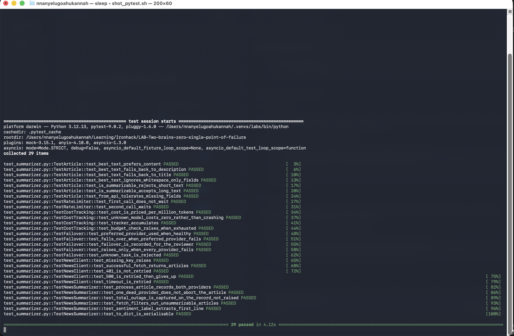
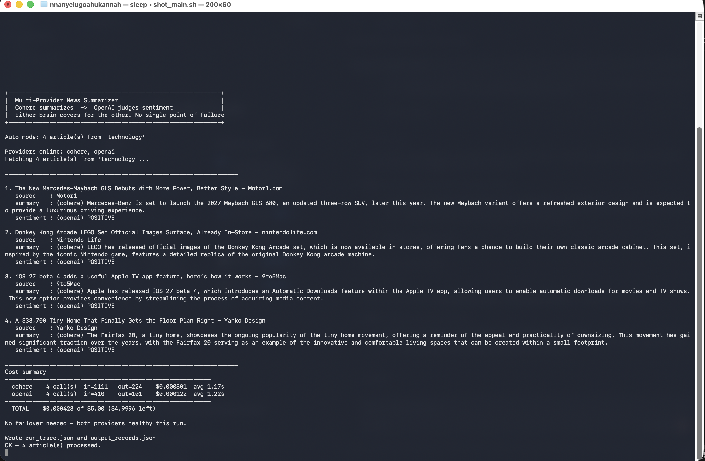
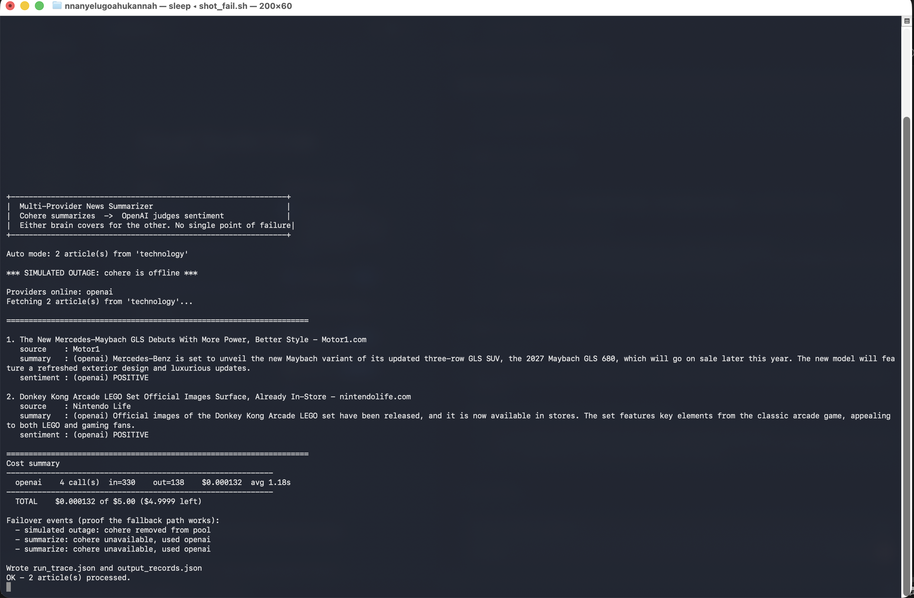

# Multi-Provider News Summarizer

**LAB | Two brains, zero single point of failure**
Author: Nnanyelugo Ahukannah

Fetches live news headlines, summarizes each on one LLM provider, and judges
sentiment on a second. Either provider can do either job, so the loss of one
degrades throughput but never stops the pipeline.

## What it does

```
NewsAPI  ->  Cohere (summarize)  ->  OpenAI (sentiment)  ->  JSON records
                    \______ either brain covers for the other ______/
```

1. Fetches top headlines from newsapi.org, with retries and client-side rate limiting.
2. Summarizes each article on **Cohere** (`command-r-08-2024`).
3. Feeds that summary to **OpenAI** (`gpt-4o-mini`) for sentiment classification.
4. Tracks token usage and cost per call, and refuses to exceed a daily budget.
5. Writes an execution trace and output records a reviewer can inspect.

Chaining matters: sentiment reads the *summary*, not the raw blurb. That is the
"passing outputs between providers" requirement, and it also gives the sentiment
model cleaner input than NewsAPI's truncated text.

### Deviation from the lab text

The lab specifies OpenAI + Anthropic. This build uses **Cohere + OpenAI**, because
Cohere is the second provider available to me. The architecture is unchanged —
what the lab tests is that two independent providers can substitute for each
other, which this demonstrates.

## Setup

```bash
pip install -r requirements.txt
```

API keys are read from a shared file outside the repo, so no key ever lands in
version control:

```
~/.config/ironhack/.env.local      # mode 600
```

It needs `COHERE_API_KEY`, `OPENAI_API_KEY`, `NEWS_API_KEY`. See `.env.example`
for the shape. A local `.env` in this folder is optional and overrides the
shared file.

Verify the environment:

```bash
python config.py          # Checkpoint 1
```

## How to run

```bash
python main.py                          # interactive
python main.py --auto -n 4              # non-interactive, 4 articles
python main.py --auto --async           # concurrent processing
python main.py --auto --simulate-outage cohere   # prove failover live
```

Or double-click `run_main.command` (macOS) / `run_main.bat` (Windows).

Tests:

```bash
pytest test_summarizer.py -v     # 29 tests, all offline
```

## Example output

```
1. The New Mercedes-Maybach GLS Debuts With More Power, Better Style
   source    : Motor1
   summary   : (cohere) Mercedes-Benz is set to launch the 2027 Maybach GLS 680,
               an updated three-row SUV, later this year.
   sentiment : (openai) POSITIVE

Cost summary
------------------------------------------------------------
  cohere    4 call(s)  in=1111   out=225    $0.000302  avg 1.26s
  openai    4 call(s)  in=409    out=110    $0.000127  avg 1.02s
------------------------------------------------------------
  TOTAL    $0.000429 of $5.00 ($4.9996 left)
```

With `--simulate-outage cohere`, OpenAI takes over both jobs and the trace records it:

```
*** SIMULATED OUTAGE: cohere is offline ***
Providers online: openai
Failover events (proof the fallback path works):
  - summarize: cohere unavailable, used openai
```

## Screenshots

| what | file |
|---|---|
| 29 unit tests passing | `screenshots/pytest_passing.png` |
| app processing 4 articles | `screenshots/main_app_running.png` |
| failover: Cohere offline, OpenAI covers both jobs | `screenshots/failover_demo.png` |







## Cost analysis

Both models are priced at **$0.15 / 1M input** and **$0.60 / 1M output** tokens.

| run | articles | LLM calls | cost |
|---|---|---|---|
| Checkpoint 4 | 2 | 4 | $0.000218 |
| Checkpoint 6 | 4 | 8 | $0.000445 |

That is roughly **$0.00011 per article**, or about **9,000 articles** inside the
$5.00 daily budget. Cost is dominated by input tokens, because a summarization
prompt is long relative to its two-sentence answer.

Optimisations worth making before scale:
- **Cache by article URL.** Re-processing an unchanged article is pure waste.
- **Skip thin articles.** `Article.is_summarizable()` already drops anything
  under 80 characters, which avoids paying to summarize a headline.
- **Batch sentiment.** Several summaries could be classified in one call, cutting
  the per-call prompt overhead that dominates this workload.

## Files

| file | purpose |
|---|---|
| `config.py` | env loading, validation, budget settings |
| `news_api.py` | NewsAPI client, retries, rate limiting |
| `llm_providers.py` | both providers, failover pool, cost tracking |
| `summarizer.py` | the pipeline; sync and async |
| `test_summarizer.py` | 29 offline unit tests |
| `main.py` | interactive CLI, writes trace + records |
| `run_trace.json` | execution trace, healthy run |
| `run_trace_failover.json` | execution trace with Cohere offline |
| `output_records.json` | processed article records |

## Known limits

- **NewsAPI free tier truncates `content` to ~200 characters.** Summaries are
  therefore of blurbs, not full articles. `Article.best_text()` falls back
  `content` → `description` → `title` to use the richest field available.
- **Cost figures are estimates** from published per-token rates, not billed
  amounts. Treat them as a budget guard, not an invoice.
- **The async path uses worker threads.** Both provider SDKs are synchronous, so
  `asyncio.to_thread` gives real overlap without pretending the clients are async.
